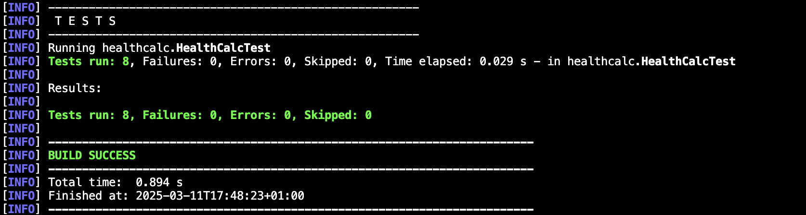
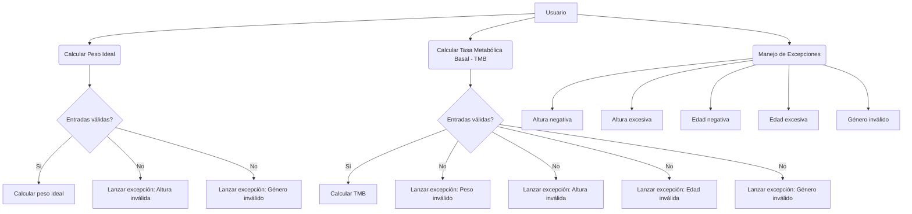
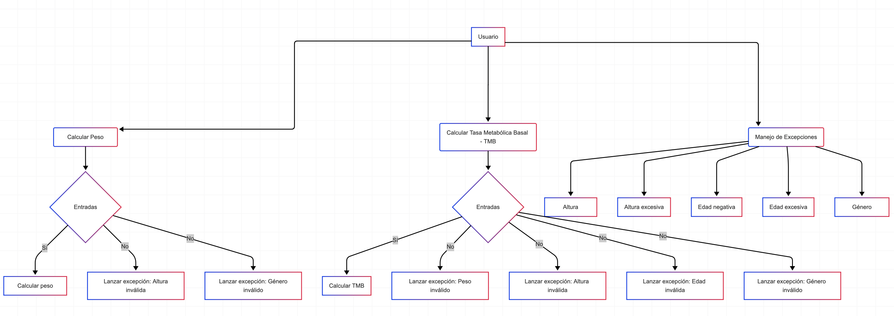
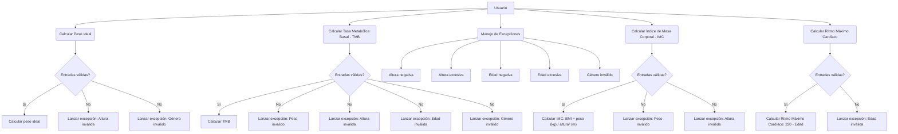
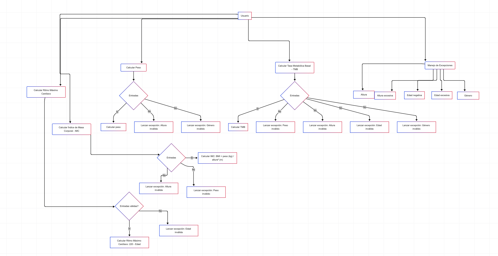

# isa2025-healthcalc
Health calculator used in Ingeniería del Software Avanzada
## Practice 1:
Tests:
### 1. **Ideal Body Weight Tests**
   - **Test Case 1**: Calculate the ideal body weight for a 180 cm tall man.
     - **Expected Result**: The ideal body weight should be 72.5 kg.
   
   - **Test Case 2**: Calculate the ideal body weight for a 160 cm woman.
     - **Expected Result**: The ideal body weight should be 56.0 kg.

   - **Test Case 3**: Check if an exception is thrown when the height is negative.
     - **Expected Result**: The function should throw an exception (`HealthCalcException`).

   - **Test Case 4**: Check if an exception is thrown when an invalid gender is provided.
     - **Expected Result**: The function should throw an exception (`HealthCalcException`).

### 2. **Basal Metabolic Rate (BMR) Tests**
   - **Test Case 5**: Calculate the BMR for a man who weighs 70 kg, is 175 cm tall, and is 30 years old.
     - **Expected Result**: The BMR should be 1695.67 kcal/day.
   
   - **Test Case 6**: Calculate the BMR for a woman who weighs 60 kg, is 160 cm tall, and is 25 years old.
     - **Expected Result**: The BMR should be 1389.84 kcal/day.

   - **Test Case 7**: Check if an exception is thrown when the age is negative.
     - **Expected Result**: The function should throw an exception (`HealthCalcException`).

   - **Test Case 8**: Check if an exception is thrown when an invalid gender is provided.
     - **Expected Result**: The function should throw an exception (`HealthCalcException`).

# Test Results

This is the screenshot of the test results using Maven:

## Practice 2:
### UML diagram:

### Extended UML diagram:

# Use case description:
# Body Mass Index (BMI) Calculation
## Stakeholders:
- **User**: Wants to calculate their BMI to assess their health status.
- **Software development team**: Ensure the proper functioning of HealthCalc.
## Main actor:
- **User**
## Scope:
- **HealthCalc application**
## Level of abstraction:
- **USER GOAL**: Describes a user-system interaction.
## Preconditions:
- The user can successfully run the calculator program.
- The user must enter valid weight and height.
- Height must be greater than 0.
- Weight must be greater than 0.
## Guarantees:
- **Minimal**: An error message is displayed to the user, explaining which part has failed.
- **Successful**: The system calculates and shows the user's BMI based on the formula BMI = weight (kg) / height² (m).
## Trigger:
- The user selects the "Calculate BMI" option in the HealthCalc program.
## Main Scenario:
1. The user selects the "Calculate BMI" option in the HealthCalc program.
2. The system prompts the user to fill in the parameters (weight, height).
3. The user enters the parameter values.
4. The system validates the entered data.
5. If the data is valid, the system calculates the BMI using the formula BMI = weight / height².
6. The system displays the BMI result.
## Extensions:
### 3a. The user enters invalid parameters.
  - 3a.1. The system displays an error message, indicating which fields are incorrect.
  - 3a.2. Returns to step 2.
### 4a. The result is outside a realistic range.
  - 4a.1. The system displays a warning message if the calculated BMI is negative or unrealistic.
  - 4a.2. Returns to step 2.

